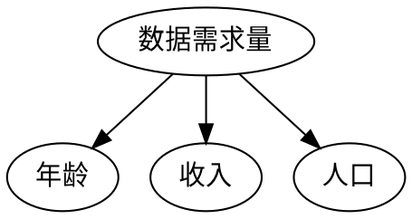
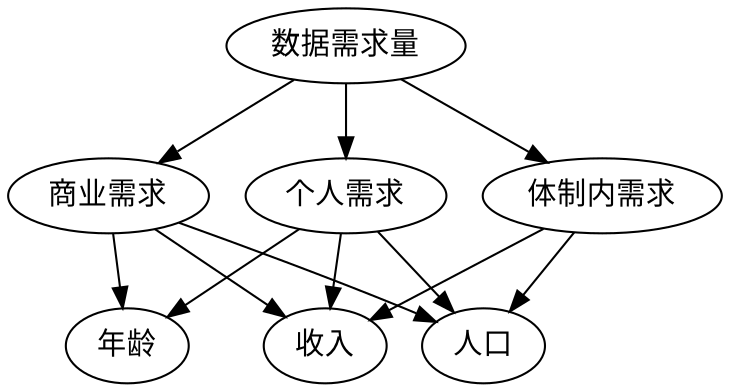

###整理一下思路
1. 层次分析法分析年龄/收入/人口对个人需求量的权重$p,q,1-p-q$
2. 对每个城市的数据需求量进行评分：
    (1) 数据需求量应当与收入正相关，但随着收入的增加，数据需求量的增长率不会一直保持水平，应该随收入的增加而逐渐降低。则人均可支配收入以对数尺度评分，即
    $$广州市人均可支配收入I_0=55356=a^{100}元,以广州市人均可支配收入为100分$$

    $$某市C_k的人均可支配收入I_k=a^{x_{k1}}元，则该市收入得分为x_{k1}$$

    $$任一城市C_k的收入得分x_{k1}=\log _{I_0}(I_k^{100})=\frac{100\ln I_k}{\ln I_0}$$

    (2) 当今社会，年轻人的数据需求量较大。数据需求量的峰值应当在年龄为15岁~25岁之间达到（没错，说的就是你们学生）。各城市平均年龄样本均大于30岁，则年龄与数据需求量大致可视为负相关，以反比例尺度评分，即
    $$以广州市的平均年龄Y_0=34.4岁为100分$$
    
    $$某市C_k的平均年龄为Y_k，满足Y_0=\frac{x_{k2}}{100}·Y_k,则该市年龄得分为x_{k2}$$

    $$任一城市C_k的年龄得分x_{k2}=\frac{100Y_0}{Y_k}$$

    (3) 由于城市需求量实际上是每个人的个人需求量的总和，所以人口与数据需求量大致成线性关系，以线性尺度评分，即
    $$以广州市的人口P_0=1490.44万人为100分$$

    $$某市C_k的人口为P_k,则该市的人口得分为x_{k3}=\frac{100P_k}{P_0}$$
3. 如下表，从$2g$到$5g$，大致10年更新一代,以此作为科技自身更迭速度的标准。10年后，作为全球一线城市的广州市的数据需求量可能已经需要下一代通信技术，即数据需求量可能已经接近了$5g$网络的传输总容量。依此，假设10年后广州市的数据需求量已经达到了最大总容量$64Tb/s$的$80\%$,即$51.2Tb/s$。

|$2g$|$3g$|$4g$|$5g$|
|-|-|-|-|
|1991|1998|2008|2020？|
4. 综上，我们可以根据假设计算出各城市的数据需求量

$$C_k城的人口得分为x_{k3},收入得分为x_{k1},年龄得分为x_{k2}$$

$$年龄权重为p,收入权重为q,人口权重为1-p-q$$

$$则C_k城的总得分x_k=px_{k1}+qx_{k2}+(1-p-q)x_{k3}$$

$$十年后，广州市数据需求量为N_0=51.2Tb/s$$

$$C_k城的数据需求量N_k=N_0·\frac{x_k}{100}$$

###现在只需要用层次分析法求出p,q即可
使用1~9尺度：
@import "1~9原则.png"

方案1：

记因素A为年龄，B为收入，C为人口
我们各自评价
1. 年龄与收入对数据需求量的影响大小之比$a_{AB}$
2. 人口与年龄对数据需求量的影响大小之比$a_{CA}$
3. 人口与收入对数据需求量的影响大小之比$a_{CB}$

个人意见：大家都是上网，只要稍微温饱一些，和有很多钱的数据需求量差别已经不大（多余的钱去看电影去氪金而不是需要更多流量啊）。年龄的话区别就更不大了。所以我觉得城与城之间差别最大的还是人口决定吧。年龄和收入评分当凑数，给人口比较大的倍数。

各自取均值$a_{AB,}a_{CA,}a_{CB}$得到成对比较矩阵，另：
$$a_{BA}=\frac{1}{a_{AB}}_,a_{AC}=\frac{1}{a_{CA}}_,a_{BC}=\frac{1}{a_{CB}}$$
|N|A|B|C|
|-|-|-|-|
|A|$1$|$\large a_{AB}$|$\large a_{AC}$|
|B|$\large a_{BA}$|$1$|$\large a_{BC}$|
|C|$\large a_{CA}$|$\large a_{CB}$|$1$|
即$A=\begin{bmatrix}
   \large 1 & \large a_{AB} & \large a_{AC} \\
   \\
   \large a_{BA} & \large 1 & \large a_{BC}\\
   \\
   \large a_{CA} & \large a_{CB} & \large 1
\end{bmatrix}$
$求出最大特征根\large\lambda _{max}\normalsize及一致性指标CI=\displaystyle\frac{\lambda _{max}-3}{2},由n=3,得RI=0.58\\
判断矩阵是否一致，即判断CR=\frac{CI}{RI}=\frac{\lambda _{max}-3}{1.16}是否小于0.1\\
若矩阵具有较满意的一致性，则令(p,q,1-p-q)=\overrightarrow k,\overrightarrow k为\lambda _{max}对应的特征向量$

方案2：

记因素A为年龄，B为收入，C为人口
我们各自评价
1. 年龄与收入对流量需求的影响大小之比$a_{AB1,}a_{AB2,}a_{AB3}$
2. 人口与年龄对流量需求的影响大小之比$a_{CA1,}a_{CA2,}a_{CA3}$
3. 人口与收入对流量需求的影响大小之比$a_{CB1,}a_{CB2,}a_{CB3}$