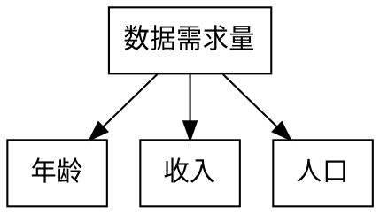
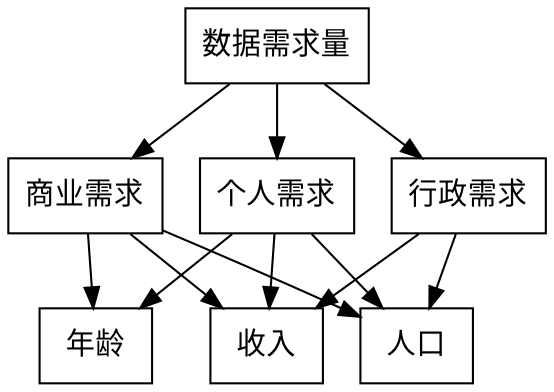
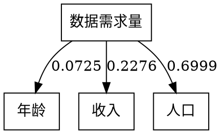

1. 层次分析法分析年龄/收入/人口对个人需求量的权重$p,q,1-p-q$

$记第一层为O层\\
记第二层为c层，商业需求为c_1,个人需求为c_2,行政需求为c_3\\
记第三层为p层，年龄为p_1,收入为p_2,人口为p_3$

我们经过综合讨论，给出了一致的意见，构造各层次的成对比较矩阵

$c层对O层：$
$c层对数据需求量的成对比较矩阵为\\
A=\begin{bmatrix}
   \large 1 & \large \frac{1}{4} & \large 4 \\
   \\
   \large 4 & \large 1 & \large 8\\
   \\
   \large \frac{1}{4} & \large \frac{1}{8} & \large 1
\end{bmatrix}\\
\lambda _{max}=3.0536,CI=0.0268,RI=0.58,CR=0.0462,接受该矩阵\\
商业需求，个人需求，行政需求的比重分别为0.2227,0.7071,0.0702$

$p层对c层：$
$p层对c_1的成对比较矩阵B_1=\begin{bmatrix}
   \large 1 & \large \frac{1}{8} & \large\frac{1}{6} \\
   \\
   \large 8 & \large 1 & \large 1\\
   \\
   \large 6 & \large 1 & \large 1
\end{bmatrix}$

$p层对c_2的成对比较矩阵B_2=\begin{bmatrix}
   \large 1 & \large \frac{1}{2} & \large \frac{1}{8} \\
   \\
   \large 2 & \large 1 & \large \frac{1}{7}\\
   \\
   \large 8 & \large 7 & \large 1
\end{bmatrix}$

$p层对c_3的成对比较矩阵B_3=\begin{bmatrix}
\large 1 & \large \frac{1}{2}\\
\\
\large 2 & \large 1\\
\end{bmatrix}$

$\lambda _{max}^{(3)}=(3.0092,3.0349,2),
权向量矩阵W^{(3)}=\begin{bmatrix}
   0.0672 & 0.0813 & 0 \\
   0.4887 & 0.1349 & 0.3333 \\
   0.444  & 0.7838 & 0.6667
\end{bmatrix}$

$组合权向量\omega^{(3)}=\begin{bmatrix}
   0.0672 & 0.0813 & 0 \\
   0.4887 & 0.1349 & 0.3333 \\
   0.444  & 0.7838 & 0.6667
\end{bmatrix}×\begin{bmatrix}
   0.2227 \\
   0.7071 \\
   0.0702
\end{bmatrix}=\begin{bmatrix}
   0.0725 \\
   0.2276 \\
   0.6999
\end{bmatrix}$

$CI^{(3)}=[0.0046,0.0174,0]\begin{bmatrix}
   0.2227 \\
   0.7071 \\
   0.0702
\end{bmatrix}=0.0133$

$RI^{(3)}=[0.58,0.58,0]\begin{bmatrix}
   0.2227 \\
   0.7071 \\
   0.0702
\end{bmatrix}=0.5393$

$CR^{(3)}=0.0462+\displaystyle\frac{0.0133}{0.5393}=0.0709<0.1,通过层次总排序一致性检验。$

综上，接受层次分析结果，得到

2. 对每个城市的数据需求量进行评分：
    (1) 数据需求量应当与收入正相关，但随着收入的增加，数据需求量的增长率不会一直保持水平，应该随收入的增加而逐渐降低。则人均可支配收入以对数尺度评分，即
    $$广州市人均可支配收入I_0=55356=a^{100}元,以广州市人均可支配收入为100分$$

    $$某市C_k的人均可支配收入I_k=a^{x_{k1}}元，则该市收入得分为x_{k1}$$

    $$任一城市C_k的收入得分x_{k1}=\log _{I_0}(I_k^{100})=\frac{100\ln I_k}{\ln I_0}$$

    (2) 当今社会，年轻人的数据需求量较大。数据需求量的峰值应当在年龄为15岁~25岁之间达到（没错，说的就是你们学生）。各城市平均年龄样本均大于30岁，则年龄与数据需求量大致可视为负相关，以反比例尺度评分，即
    $$以广州市的平均年龄Y_0=34.4岁为100分$$
    
    $$某市C_k的平均年龄为Y_k，满足Y_0=\frac{x_{k2}}{100}·Y_k,则该市年龄得分为x_{k2}$$

    $$任一城市C_k的年龄得分x_{k2}=\frac{100Y_0}{Y_k}$$

    (3) 由于城市需求量实际上是每个人的个人需求量的总和，所以人口与数据需求量大致成线性关系，以线性尺度评分，即
    $$以广州市的人口P_0=1490.44万人为100分$$

    $$某市C_k的人口为P_k,则该市的人口得分为x_{k3}=\frac{100P_k}{P_0}$$
3. 如下表，从$2g$到$5g$，大致10年更新一代,以此作为科技自身更迭速度的标准。10年后，作为全球一线城市的广州市的数据需求量可能已经需要下一代通信技术，即数据需求量可能已经接近了$5g$网络的传输总容量。依此，假设10年后广州市的数据需求量已经达到了最大总容量$64Tb/s$的$90\%$,即$57.6Tb/s$。

|$2g$|$3g$|$4g$|$5g$|
|-|-|-|-|
|1991|1998|2008|2020？|
4. 综上，我们可以根据假设计算出各城市的数据需求量

$$C_k城的人口得分为x_{k3},收入得分为x_{k2},年龄得分为x_{k1}$$

$$年龄权重为p=0.0725,收入权重为q=0.2276,人口权重为1-p-q=0.6999$$

$$则C_k城的总得分x_k=px_{k1}+qx_{k2}+(1-p-q)x_{k3}$$

$$十年后，广州市数据需求量为N_0=57.6Tb/s$$

$$C_k城的数据需求量N_k=N_0·\frac{x_k}{100}$$