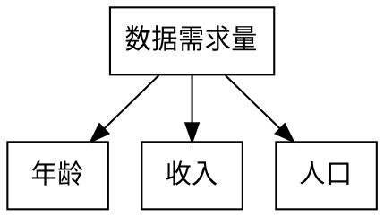
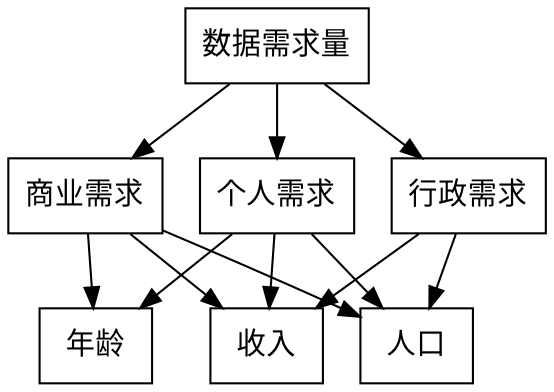
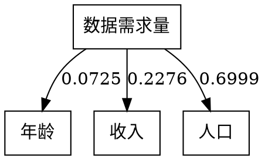

#2019深圳杯
##待研究的问题
现有一个32单元相控天线阵列，移相器配置有4种方式$(0°,90°,180°,270°)$。采用仪器测量每种相位配置下的3D空间分布（数据参见附件一）。使用数据时需要考虑数据中存在的测量误差：移相器配置为$90°$和$180°$，两者信号相差$（90±err)°$，其中$err$为测量误差。

数据预处理排除测量错误数据

###微波问题1
>假设：
1.合成功率为$35dBm$；
2.旁瓣电平尽可能低；
3.可以选择关闭某些通道；
4.在位置$AZ=10°$，俯仰$EL=10°$处有一站点，波束设计时避免对该站点的干扰。
请给出方位(水平角$AZ=10°$，俯仰角$EL=5°$)
对应的波束配置(移相器配置矢量$\vec{z}=[∆_1,…,∆_N]$)

目标函数$$T=u_1 (E) u_2 (E_S ) u_3 (E_d )$$
$u_1 (E)=\begin{cases}
     1 ,E≥35\\
     0 ,E<35
\end{cases}$    满足条件1与否
$u_2 (E_S,E)=E_S/E$ 信噪比尽可能大
$u_3 (E_d )=1/E_d$ 干扰项尽可能小

$$E=∑_{i=1}^{32}e_{ij_i} $$  

对于每一个波束，有五种配置方式（关闭波束，移相器配置1，配置2，配置3，配置4）
	采用遗传算法，搜索目标函数最大值点。
	
###微波问题2
>波束配置矢量要求：
1.整个覆盖区域内，平均辐射功率$35dBm$
2.波束覆盖的“凹坑”尽可能小
3.覆盖波束个数尽可能少
4.用尽可能少的波束，覆盖水平角$±30°$，俯仰角$±15°$的区域
请给出波束配置列表$[z_1,z_2,…,z_M]$（M为波束个数）

对于问题3：先评判最少需要的波束个数，再采用二分法找到尽可能小的波束

###骨干网问题1
>随着众多网络接入技术的发展，以及未来用户数据需求量呈指数形式的增长，城市之间的骨干网输入输出端口带宽与容量需求也将爆炸式增长。使用最新的通信技术升级改造骨干网已成为运营商应对未来通信市场需求的一个迫在眉睫的举动。
现需要在广东省对已有骨干网进行满足电信市场要求的改造。个人信息接入需求量会随着新科技在群众中的接受度，科技自身更迭速度等因素变化；同时各个年龄段，各收入阶层对信息需求量也有不同。请预估未来十年（截止2028年）信息时代各类人群所需要的信息量，以满足广东省全部人口的信息接入需求为目标，省会广州市为数据中心，选择性地用最新的通信技术更新从广州到其余主要行政城市的骨干网络。（城市之间连接的城际网可选用的调制格式及其特性见附件二中）。
请参考广东省一些相关数据，自我构造约束条件，为广东省未来电信市场建立一个有效的部署价值函数，用这个价值函数寻找到网络价值最大化的部署方案。作为电信从业人员网络部署设计方案的参考。

1. 层次分析法分析年龄/收入/人口对个人需求量的权重$p,q,1-p-q$
以下将城市数据需求量简记为数据需求量，城市平均年龄简记为年龄，城市人均可支配收入简记为收入，城市总人口简记为人口。

$记第一层为O层\\
记第二层为c层，商业需求为c_1,个人需求为c_2,行政需求为c_3\\
记第三层为p层，年龄为p_1,收入为p_2,人口为p_3$

我们经过综合讨论，给出了一致的意见，构造各层次的成对比较矩阵

$c层对O层：$
$c层对数据需求量的成对比较矩阵为\\
A=\begin{bmatrix}
   \large 1 & \large \frac{1}{4} & \large 4 \\
   \\
   \large 4 & \large 1 & \large 8\\
   \\
   \large \frac{1}{4} & \large \frac{1}{8} & \large 1
\end{bmatrix}$

$\lambda _{max}=3.0536,CI=0.0268,RI=0.58,CR=0.0462,接受该矩阵\\
商业需求，个人需求，行政需求的比重分别为0.2227,0.7071,0.0702$

$p层对c层：$
$p层对c_1的成对比较矩阵B_1=\begin{bmatrix}
   \large 1 & \large \frac{1}{8} & \large\frac{1}{6} \\
   \\
   \large 8 & \large 1 & \large 1\\
   \\
   \large 6 & \large 1 & \large 1
\end{bmatrix}$

$p层对c_2的成对比较矩阵B_2=\begin{bmatrix}
   \large 1 & \large \frac{1}{2} & \large \frac{1}{8} \\
   \\
   \large 2 & \large 1 & \large \frac{1}{7}\\
   \\
   \large 8 & \large 7 & \large 1
\end{bmatrix}$

$p层对c_3的成对比较矩阵B_3=\begin{bmatrix}
\large 1 & \large \frac{1}{2}\\
\\
\large 2 & \large 1\\
\end{bmatrix}$

$\lambda _{max}^{(3)}=(3.0092,3.0349,2),
权向量矩阵W^{(3)}=\begin{bmatrix}
   0.0672 & 0.0813 & 0 \\
   0.4887 & 0.1349 & 0.3333 \\
   0.444  & 0.7838 & 0.6667
\end{bmatrix}$

$组合权向量\omega^{(3)}=\begin{bmatrix}
   0.0672 & 0.0813 & 0 \\
   0.4887 & 0.1349 & 0.3333 \\
   0.444  & 0.7838 & 0.6667
\end{bmatrix}×\begin{bmatrix}
   0.2227 \\
   0.7071 \\
   0.0702
\end{bmatrix}=\begin{bmatrix}
   0.0725 \\
   0.2276 \\
   0.6999
\end{bmatrix}$

$CI^{(3)}=[0.0046,0.0174,0]\begin{bmatrix}
   0.2227 \\
   0.7071 \\
   0.0702
\end{bmatrix}=0.0133$

$RI^{(3)}=[0.58,0.58,0]\begin{bmatrix}
   0.2227 \\
   0.7071 \\
   0.0702
\end{bmatrix}=0.5393$

$CR^{(3)}=0.0462+\displaystyle\frac{0.0133}{0.5393}=0.0709<0.1,通过层次总排序一致性检验。$

综上，接受层次分析结果，得到

2. 
$\small线路格式有三种：S_1,S_2,S_3,传输容量各为t_1,t_2,t_3,\\
最大传输距离各为d_1,d_2,d_3,总容量各为St_1,St_2,St_3,标准成本为CO_1,CO_2,CO_3\\
有城市C_0,C_1,…,C_p,平均年龄为Y_0,Y_1,…,Y_n,人均可支配收入分为I_0,I_1,…,I_m,\\
人口分为P_0,P_1,…,P_k,其中X_0为广州市,对每个城市的数据需求量进行评分：$
(1) 数据需求量应当与收入正相关，但随着收入的增加，数据需求量的增长率不会一直保持水平，应该随收入的增加而逐渐降低。则人均可支配收入以对数尺度评分，即
$$广州市人均可支配收入I_0=5.5356=a^{100}万元,以广州市人均可支配收入为100分$$

$$某市C_k的人均可支配收入I_k=a^{x_{k1}}万元，则该市收入得分为x_{k1}$$

$$任一城市C_k的收入得分x_{k1}=\log _{I_0}(I_k^{100})=\frac{100\ln I_k}{\ln I_0}$$

(2) 当今社会，年轻人的数据需求量较大。数据需求量的峰值应当在年龄为15岁~25岁之间达到（没错，说的就是你们学生）。各城市平均年龄样本均大于30岁，则年龄与数据需求量大致可视为负相关，以反比例尺度评分，即
$$以广州市的平均年龄Y_0=34.4岁为100分$$
    
$$某市C_k的平均年龄为Y_k，满足Y_0=\frac{x_{k2}}{100}·Y_k,则该市年龄得分为x_{k2}$$

$$任一城市C_k的年龄得分x_{k2}=\frac{100Y_0}{Y_k}$$

(3) 由于城市需求量实际上是每个人的个人需求量的总和，所以人口与数据需求量大致成线性关系，以线性尺度评分，即
$$以广州市的人口P_0=1490.44万人为100分$$

$$某市C_k的人口为P_k,则该市的人口得分为x_{k3}=\frac{100P_k}{P_0}$$

3. 如下表，从$2g$到$5g$，大致10年更新一代,以此作为科技自身更迭速度的标准。10年后，广东省的数据需求量可能已经需要下一代通信技术，即数据需求量可能已经接近了$5g$网络的传输总容量。依此，假设10年后广东省的数据需求量已经达到了（所提供传输格式的）最大总容量$64Tb/s$的$90\%$,即$57.6Tb/s$。

|$2g$|$3g$|$4g$|$5g$|
|-|-|-|-|
|1991|1998|2008|2020？|

4. 综上，我们可以根据假设计算出各城市的数据需求量

#需要修改，论文写作时统一修改

$$C_k城的人口得分为x_{k3},收入得分为x_{k2},年龄得分为x_{k1}$$

$$年龄权重为p=0.0725,收入权重为q=0.2276,人口权重为1-p-q=0.6999$$

$$则C_k城的总得分x_k=px_{k1}+qx_{k2}+(1-p-q)x_{k3}$$

$$十年后，广州市数据需求量为N_0=57.6Tb/s$$

$$C_k城的数据需求量N_k=N_0·\frac{x_k}{100}$$

现已完成所有城市数据需求量的评估，记录在城市数据.xlsx中。

5. 由传输距离/容量/成本表格

传输格式$C_i$|传输容量$t_i$ | 最大传输距离$d_i$ | 总容量$St_i$ | 标准成本$CO_i$
------------|-------------|------------------|--------------|-----
$C_1$|$400 Gb/s$ | $200 km$ | $32Tb/s$ | $X万元$
$C_2$|$600 Gb/s$ | $100 km$ | $48Tb/s$ |  $1.25X万元$
$C_3$|$800 Gb/s$ | $ 80 km$ | $64Tb/s$ | $1.5X万元$
由$\{N_k\}$则可得到各个城市所需要的最低级别线路。越高级的线路价格越高，但若有连接需要也可以铺设高级线路。
在两城之间铺设线路的实际成本为：
$$选择传输格式C_i,两城距离为D_{jk},传出需求量为N_k(不能大于St_i),\\
则光缆中需要的光纤数为n=\Big[\frac{N_k}{t_i}\Big]+1,成本为CO=n·CO_i$$

以广州市为中心，向外铺出骨干网。这是一个权可变（各条线最多三种）的加权图论问题，可能可以使用蚁群算法及其各种优化，留待ldl解决。

###骨干网问题2
>某通信公司曾提出：“建立一个万物互联的世界”。而在现实社会中，站在运营商角度，每个人的接入价值是不一样的，不同收入、地区、年龄的人接入成本和数据需求都不一样。如果将不同人群的网络接入价值也纳入考虑，并选择性的接入网络价值大的人群，请重新构建网络价值函数，并找到新的最优部署方案。

传输格式$C_i$|传输容量$t_i$ | 总容量$St_i$ | 最大光纤数$M_i$
------------|-------------|--------------|-----
$C_1$|$400 Gb/s$  | $32Tb/s$ | $80$
$C_2$|$600 Gb/s$  | $48Tb/s$ | $80$
$C_3$|$800 Gb/s$  | $64Tb/s$ | $80$

不同于问题1，问题2中权的参数可变范围
从$\enspace\theta=C_i\quad(1\leqslant i\leqslant 3)\enspace$变为$\enspace\theta=(C_i,m)\quad(1\leqslant i\leqslant 3,1\leqslant m\leqslant 80)$
问题的本质没有变，但复杂度上升了非常多。

